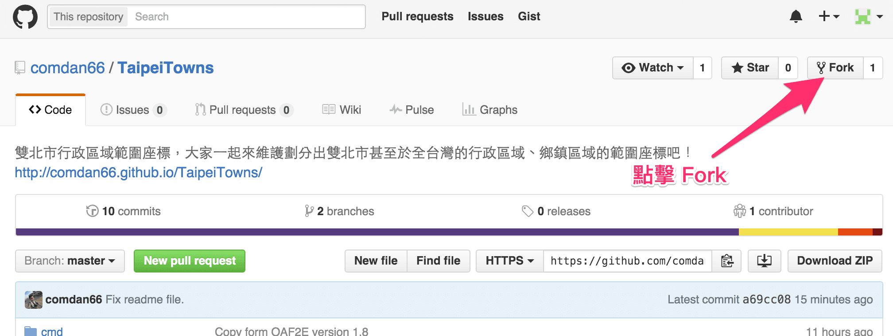
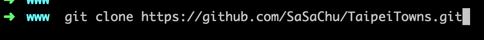
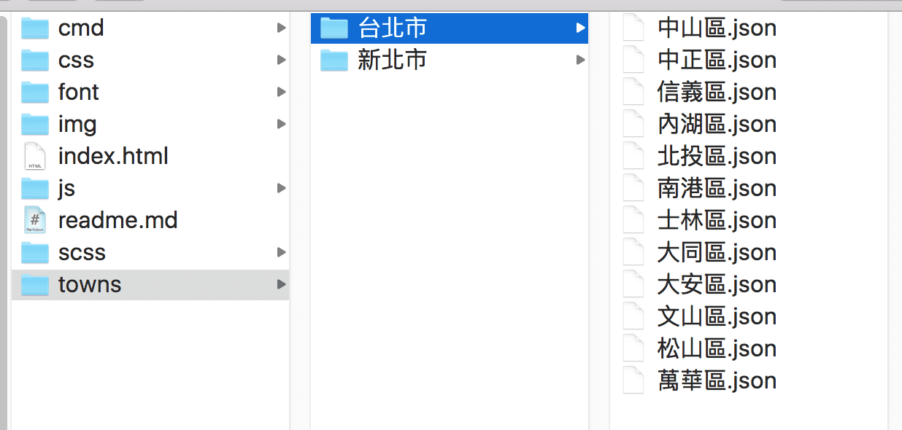
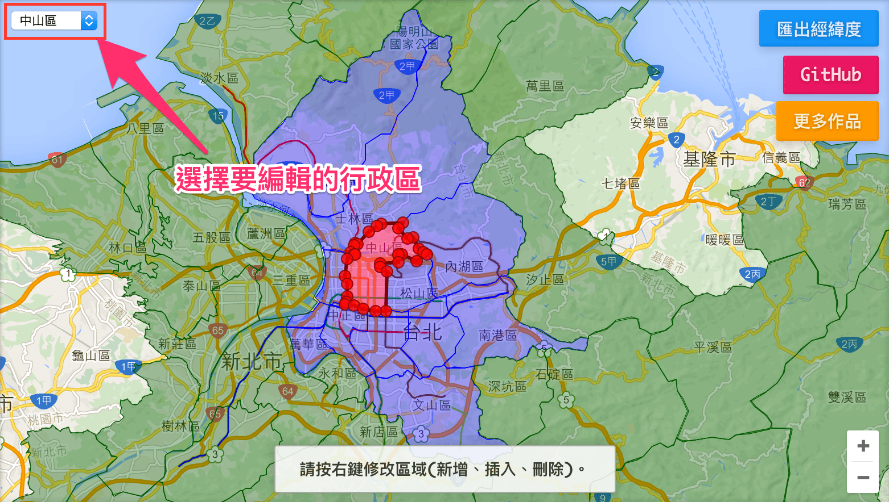
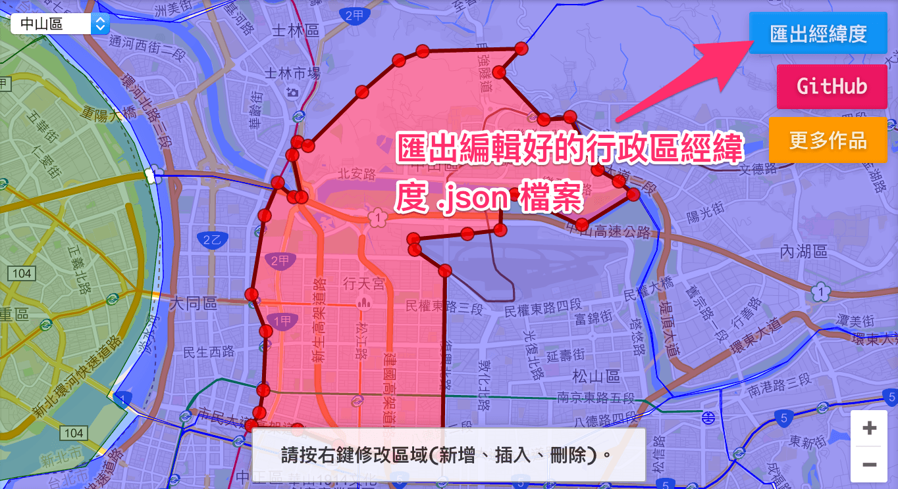
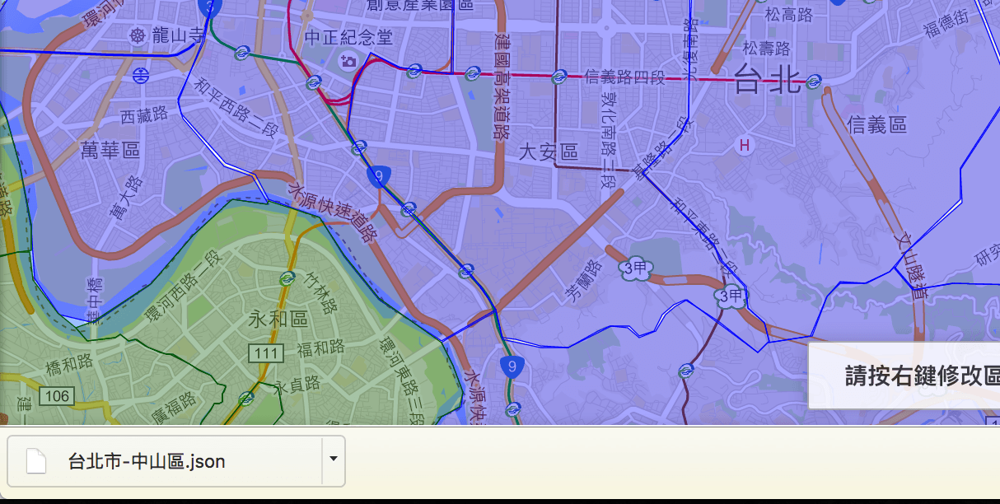
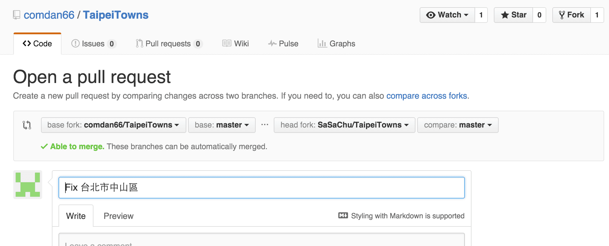
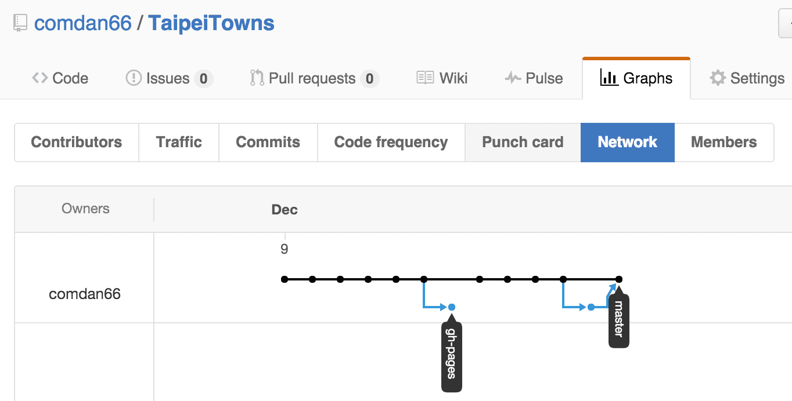

# Welcome To OA's Taipei Towns!
雙北市行政區域範圍座標，大家一起來維護劃分出雙北市甚至於全台灣的行政區域、鄉鎮區域的範圍座標吧！

---
## 聲明
本作品授權採用 姓名標示-非商業性 2.0 台灣 (CC BY-NC 2.0 TW) 授權，詳見 [http://creativecommons.org/licenses/by-nc/2.0/tw/](http://creativecommons.org/licenses/by-nc/2.0/tw/)

 
## DEMO
* 範例網址：[http://works.ioa.tw/TaipeiTowns/](http://works.ioa.tw/TaipeiTowns/)

 
## 簡介
* 開始主要目的是為了取得雙北市行政區域範圍座標。
* 但因為 Google maps js API 找不到可以取得行政區的範圍座標，故才自己畫完雙北市的範圍座標。
* 藉此分享出來給大家使用，各位大大也可以 Fork 並且新增修改完後，發個 Pull Request 讓我合併，大家一起維護並且分享！
* 希望大家可以一起維護，建立更多的行政區域範圍座標，並且提供給更多需要的人！

 
## 步驟
* 點擊 [http://works.ioa.tw/TaipeiTowns/](http://works.ioa.tw/TaipeiTowns/) 右上方 Fork。

* Clone 專案到本機。

* 各鄉鎮行政區域的檔案放置在 `towns/` 下，分別依照不同縣市資料夾分類，每個檔案接用區域名稱命名。

* 開啟網頁後 [http://127.0.0.1/TaipeiTowns/](http://127.0.0.1/TaipeiTowns/)，於左上角選擇要編輯的區域。

* 利用滑鼠右鍵，會有 新增、插入、刪除 節點的功能，可以對所選的區域做編輯。

* 編輯完後，點擊右上方 **匯出經緯度** 的按鈕後，即可下載行政區的 `.json` 檔案。

* 下載剛編輯的行政區域 .json 檔案。

* 將該 `.json` 檔案放置 `towns/` 下所對應的行政區，即可修正原本的範圍座標。

* 修改完 commit 後，對 [TaipeiTowns](https://github.com/comdan66/TaipeiTowns/pulls) 發 **Pull Requests**。

* [OA](https://github.com/comdan66) 確認後即會 merge。

 
## 關於
* 作者名稱 - [OA Wu](http://www.ioa.tw/)

* E-mail - <comdan66@gmail.com>

* 作品名稱 - OA's Taipei Towns

* 最新版本 - 1.1

* GitHub - [OA's Taipei Towns](https://github.com/comdan66/TaipeiTowns)

* 更新日期 - 2015/12/10